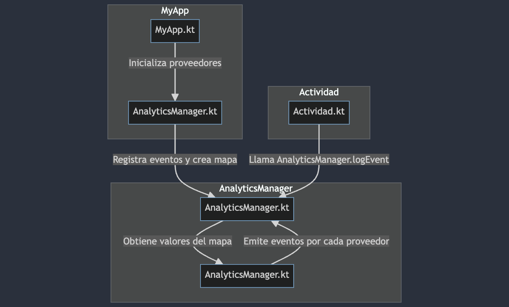

# Event-Hub-Manager

Este proyecto Android utiliza la clase `AnalyticsManager` para facilitar la gestión de eventos de análisis a través de diversos proveedores. La estructura del proyecto se organiza en paquetes lógicos para mejorar la legibilidad y extensibilidad del código.


## Configuración

Antes de utilizar `AnalyticsManager`, realiza la inicialización de los proveedores necesarios en la clase de aplicación (`MyApp.kt`).

```kotlin
class MyApp : Application() {

    override fun onCreate() {
        super.onCreate()

        // Inicializa los proveedores de análisis
        val analyticsProviders = listOf(
            // Lista de proveedores aquí
        )

        AnalyticsManager.initialize(analyticsProviders)
    }
}
```
# Diagram




## Uso

Utiliza `AnalyticsManager` para gestionar eventos de análisis en cualquier parte de tu aplicación. La clase proporciona métodos para registrar eventos específicos con parámetros opcionales.

```kotlin
// Ejemplo de registro de un evento con parámetros
private fun sendEventA() {
    val params = Bundle().apply {
        putString("key1", "value1")
        putInt("key2", 42)
    }

    AnalyticsManager.logEvent(HOME_SCREEN_CLICK_PRIMARY_BUTTON, params)
}

// Ejemplo de registro de un evento sin parámetros
private fun sendEventB() {
    AnalyticsManager.logEvent(HOME_SCREEN_CLICK_SECONDARY_BUTTON)
}
```

### 1. Inicialización de Proveedores

En `MyApp.kt`, se inicializan los proveedores de análisis mediante la llamada a `AnalyticsManager.initialize(analyticsProviders)`.

```kotlin
// Ejemplo de inicialización en MyApp.kt
val analyticsProviders = listOf(
    AnalyticsManager.FirebaseAnalyticsProvider(this),
    AnalyticsManager.GoogleFirebaseAnalyticsProvider(this),
    // Agrega otros proveedores según sea necesario
)

AnalyticsManager.initialize(analyticsProviders)
```

### 2. Registro de Eventos

En cualquier parte de la aplicación, puedes utilizar `AnalyticsManager.logEvent(eventName, params)` para registrar eventos. La clase se encarga de distribuir el evento a los proveedores configurados.

```kotlin
// Ejemplo de registro de evento en cualquier parte de la aplicación
AnalyticsManager.logEvent(HOME_SCREEN_CLICK_PRIMARY_BUTTON, params)
```

La clase `AnalyticsManager` recorre los proveedores registrados y llama a sus métodos `logEvent` con el nombre del evento y los parámetros proporcionados.

## Contribuciones

¡Las contribuciones son bienvenidas! Si tienes sugerencias, problemas o nuevas funcionalidades, abre un "issue" o crea una "pull request".

## Licencia

Este proyecto está bajo la Licencia MIT. Consulta [LICENSE.md](LICENSE.md) para más detalles.
