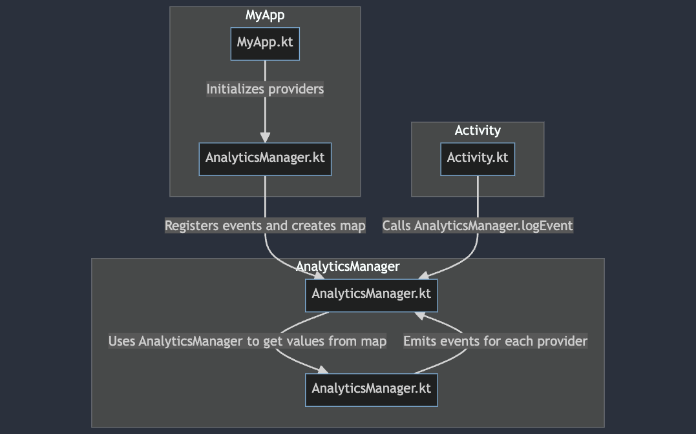

# Event-Hub-Manager

This Android project utilizes the `AnalyticsManager` class to facilitate the management of analytics events across various providers. The project's structure is organized into logical packages to enhance code readability and extensibility.


## Configuration

Before using `AnalyticsManager`, initialize the necessary providers in the application class (`MyApp.kt`).

```kotlin
class MyApp : Application() {

    override fun onCreate() {
        super.onCreate()

        // Initialize analytics providers
        val analyticsProviders = listOf(
            // List of providers here
        )

        AnalyticsManager.initialize(analyticsProviders)
    }
}
```

# Diagram



## Usage

Use `AnalyticsManager` to manage analytics events anywhere in your application. The class provides methods to log specific events with optional parameters.

```kotlin
// Example of logging an event with parameters
private fun sendEventA() {
    val params = Bundle().apply {
        putString("key1", "value1")
        putInt("key2", 42)
    }

    AnalyticsManager.logEvent(HOME_SCREEN_CLICK_PRIMARY_BUTTON, params)
}

// Example of logging an event without parameters
private fun sendEventB() {
    AnalyticsManager.logEvent(HOME_SCREEN_CLICK_SECONDARY_BUTTON)
}
```

### 1. Providers Initialization

In `MyApp.kt`, analytics providers are initialized by calling `AnalyticsManager.initialize(analyticsProviders)`.

```kotlin
// Example of initialization in MyApp.kt
val analyticsProviders = listOf(
    AnalyticsManager.FirebaseAnalyticsProvider(this),
    AnalyticsManager.GoogleFirebaseAnalyticsProvider(this),
    // Add other providers as needed
)

AnalyticsManager.initialize(analyticsProviders)
```

### 2. Event Logging

Anywhere in the application, you can use `AnalyticsManager.logEvent(eventName, params)` to log events. The class handles distributing the event to configured providers.

```kotlin
// Example of event logging anywhere in the application
AnalyticsManager.logEvent(HOME_SCREEN_CLICK_PRIMARY_BUTTON, params)
```

The `AnalyticsManager` class iterates through registered providers and calls their `logEvent` methods with the event name and provided parameters.

## Contributions

Contributions are welcome! If you have suggestions, issues, or new features, please open an issue or create a pull request.

## License

This project is licensed under the MIT License. See [LICENSE.md](LICENSE.md) for more details.
